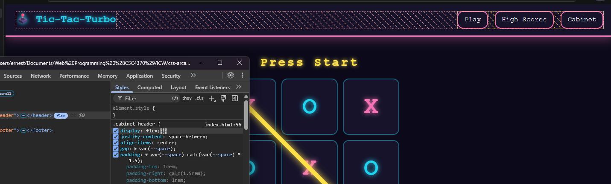
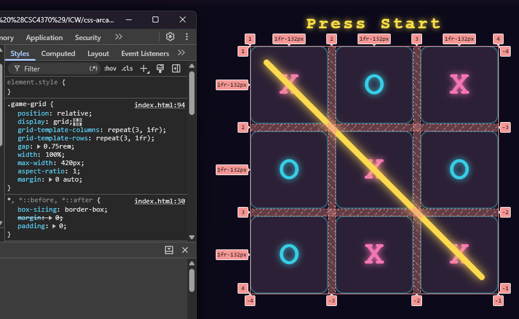
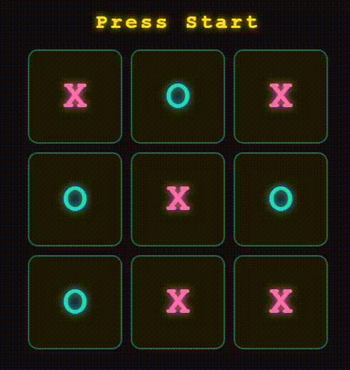
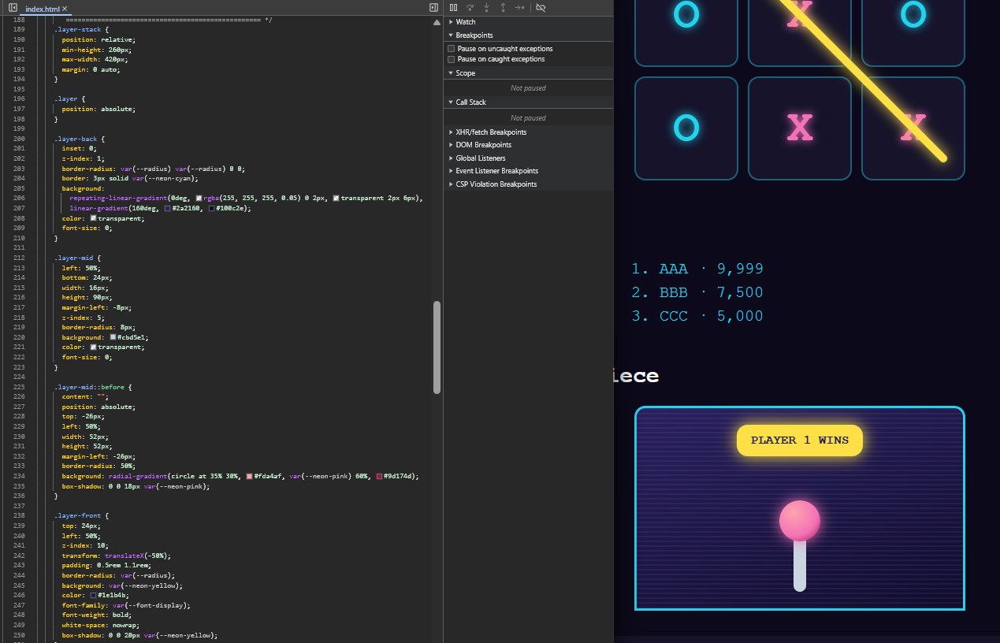
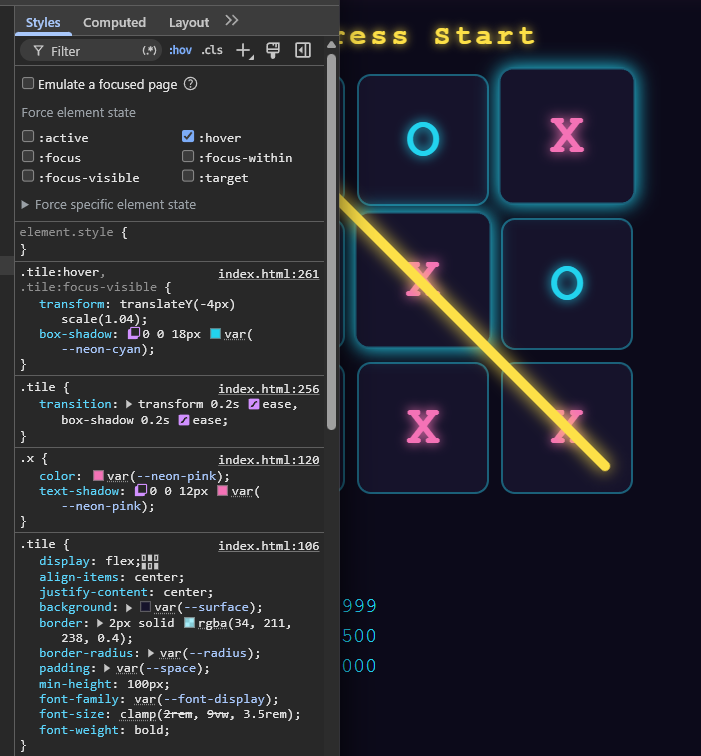
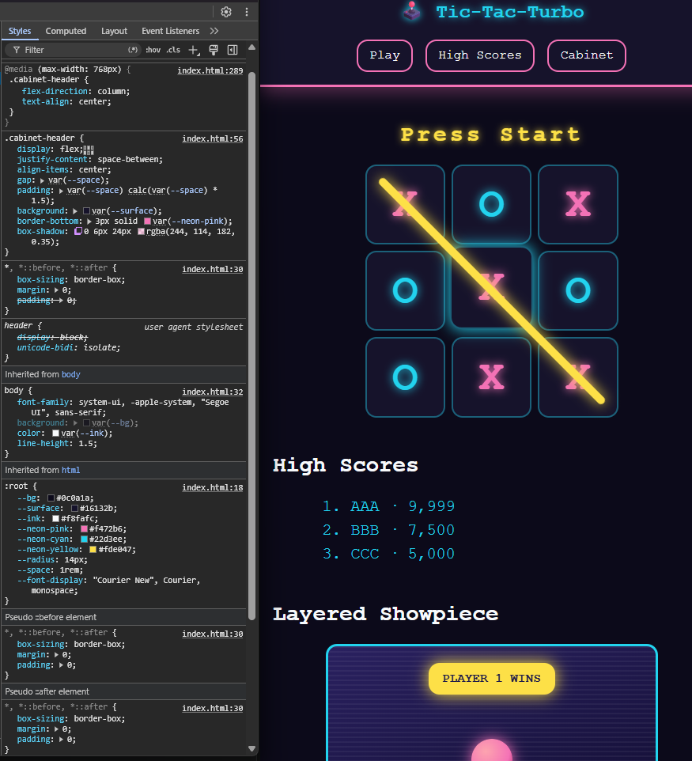
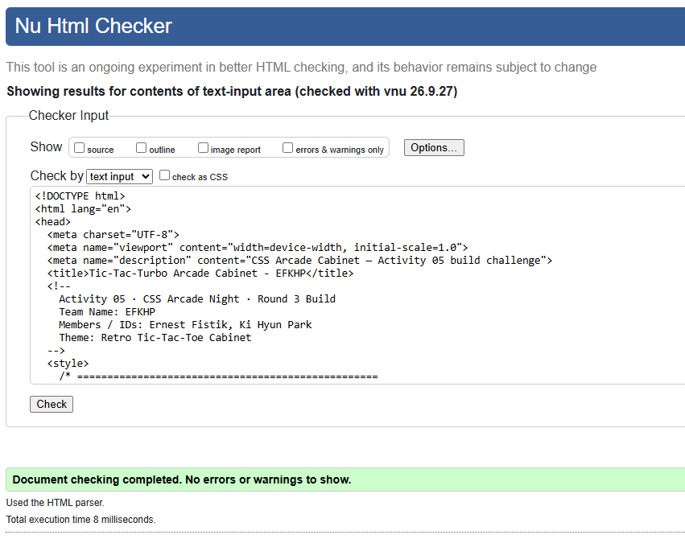
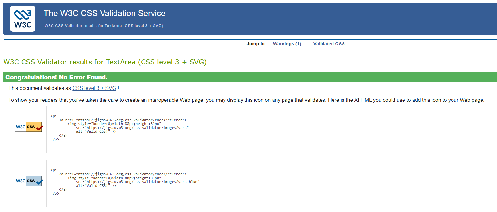
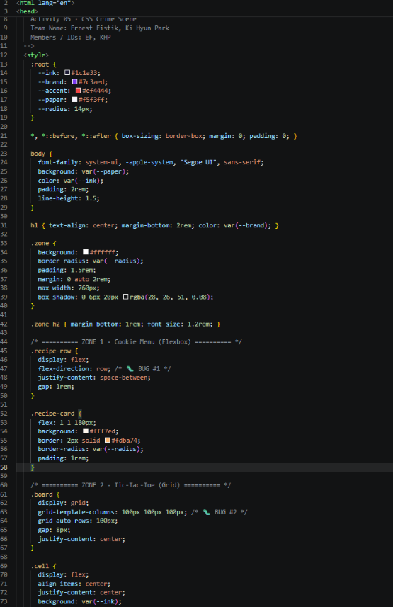

# css-arcade-EFKHP - Tic-Tac-Turbo Arcade Cabinet

Activity 05 - CSS Arcade Night - Round 3

## Team Members
- Team name: EFKHP
- Members / IDs: Ernest Fistik, Ki Hyun Park
- Google Doc: https://docs.google.com/document/d/1w8nX8tmEVbEKHrf6TVsS0iJZgDWALffEs7ciSBTjuhQ/edit?usp=sharing

## Live URL
https://codd.cs.gsu.edu/~efistik2/WP/INC/INC5/index.html

Demo: [EFKHP-Cabinet.mp4](EFKHP_Cabinet.mp4)

## Build Challenge

**Theme:** Retro Tic-Tac-Toe Cabinet, a neon arcade machine with a flex header, a 3x3 board, an animated winning line and a "PLAYER 1 WINS" badge layered over a cabinet drawn in pure CSS

| Checkpoint | Selector(s) | What satisfies it |
|---|---|---|
| 1. Flexbox Layout | `.cabinet-header`, `.cabinet-nav` | `display: flex` with `justify-content`, `align-items` and `gap` |
| 2. CSS Grid Board | `.game-grid` | `repeat(3, 1fr)` columns and rows, forming a 3 × 3 board |
| 3. Keyframe Animation | `.win-line`, `@keyframes strike` | 0% / 50% / 100% stops using `transform`, `animation-delay: 1s`, fill mode `both` |
| 4. Layered Composition | `.layer-stack`, `.layer-back`, `.layer-mid`, `.layer-front` | `position: relative` parent, absolute children at `z-index` 1, 5 and 10 |
| 5. Micro-Interaction | `.tile:hover`, `.tile:focus-visible`, `.cabinet-nav a:hover` | `transition` on `transform` and `box-shadow` |
| 6. Professional & Responsive | `:root`, `@media (max-width: 768px)` | Custom properties, no inline styles, stacked header and smaller board on small screens |

### Checkpoint 1 → `.cabinet-header` / `.cabinet-nav`

### Checkpoint 2 → `.game-grid`

### Checkpoint 3 → `.win-line` / `@keyframes strike`

### Checkpoint 4 → `.layer-stack`

### Checkpoint 5 → `.tile:hover` / `:focus-visible`

### Checkpoint 6 → `:root` / `@media (max-width: 768px)`

### Validation

### Bonus levels
- **Motion-Safe:** animations are wrapped in `@media (prefers-reduced-motion: no-preference)`.
- **Pure-CSS Art:** the cabinet screen and joystick use only gradients and pseudo-elements.

## Round 1 Findings
LAYOUT PREDICTION BLITZ — TEAM FINDINGS REPORT
Team Name: Ernest Fistik, Ki Hyun Park

SCENARIO 1 / 6 — Cookie Menu Row: We predicted "🅱 One row; outer cards touch the edges, equal space between" — CORRECT (actual: 🅱 One row; outer cards touch the edges, equal space between)
SCENARIO 2 / 6 — Tic-Tac-Toe Board: We predicted "🅰 A 3 × 3 board" — CORRECT (actual: 🅰 A 3 × 3 board)
SCENARIO 3 / 6 — Axis Flip: We predicted "🅲 Horizontally (left-to-right)" — CORRECT (actual: 🅲 Horizontally (left-to-right))
SCENARIO 4 / 6 — Fraction Launch: We predicted "🅰 Delay before the animation starts" — CORRECT (actual: 🅰 Delay before the animation starts)
SCENARIO 5 / 6 — The Snap-Back: We predicted "🅱 It snaps back to its starting position" — CORRECT (actual: 🅱 It snaps back to its starting position)
SCENARIO 6 / 6 — The Missing Heart: We predicted "🅲 In normal flow, with top/left/z-index ignored" — CORRECT (actual: 🅲 In normal flow, with top/left/z-index ignored)

Final Score: 6 / 6

## Round 2 Bug Fixes
Fixed file: `css_arcade_broken.html`

| Bug | Corrected CSS line(s) | Explanation (1-2 sentences) |
|---|---|---|
| 1 (Flexbox) | `.recipe-row { flex-direction: column; }` (was `row`) | With `flex-direction: row` the three cookie cards were forced side by side on one line and got squeezed. Changing the main axis to `column` stacks the cards so each one gets the full width of the zone. |
| 2 (Grid) | `.board { grid-template-columns: repeat(3, 100px); }` (was `100px 100px`) | The board defined only two column tracks, so the nine cells spilled into five rows of two. Three tracks give the intended 3 × 3 board. |
| 3 (Keyframes) | `#answer { animation: moveFraction 3s ease-in-out 1s both; }` (was missing `both`) | Without a fill mode, the answer sat at its final position during the 1s delay and snapped back when the animation ended. `both` applies the 0% keyframe during the delay and holds the 100% keyframe afterwards. |
| 4 (Positioning) | `.heart { position: absolute; }` (added) | `top`, `left`, `right` and `z-index` have no effect on a non-positioned element, so the heart stayed in normal flow. Making it absolute places it inside `.shirt-wrap` so `z-index: 10` layers it over the shirt. |

